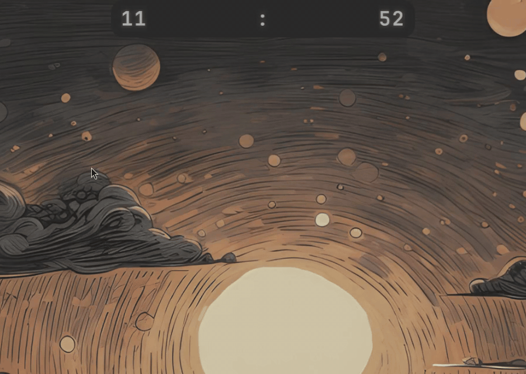

# Omaltbar

Omaltbar replaces the Omarchy bar with a notch-anchored pill that hosts your existing bar widgets and expands into a paged "island" body. It is a drop-in `bar` replacement: your widgets render unchanged, the stock bar can be restored at any time, and the plugin also registers as a normal bar widget so it can be discovered, enabled, and removed like any other Omarchy plugin.

## Demo



*The pill at rest, then the island body expanded.*

## Install

```bash
omarchy plugin add https://github.com/AngeeelD/omaltbar.git --enable
```

`omarchy` clones the repository into `~/.config/omarchy/plugins` and enables the plugin. Nothing outside that folder is required to load the bar.

## Usage

```bash
# Make Omaltbar the active bar
omarchy bar use angeeeld.omaltbar

# Switch back to the stock Omarchy bar
omarchy bar use omarchy.bar

# Apply bar changes (hot-reload is not reliable for the bar)
omarchy restart shell
```

The bar switch is reversible from the settings panel too. While another bar is active, the plugin stays installed but reports as disabled, and its settings icon only works while the island is the bar.

## Configure

```bash
# Open the settings panel by clicking the gear icon on the bar, or run:
omarchy-shell angeeeld.omaltbar.settings toggle

# Managed Hyprland shortcuts live in bar.islandHotkeys. The panel writes them
# into one marked block in ~/.config/hypr/bindings.lua and reloads Hyprland.
# Edit them through the panel; do not hand-edit that block.
```

The settings panel sections are BAR, APPEARANCE, TIMING, INTERACTION, HOTKEYS, CONTEXTS and DOCTOR. Every value persists through the shell's config API and applies live.

`bar.islandHotkeys` maps an action (`island.toggle`, `island.settings`) to a key combination. `hotkeys.sh` renders the managed block from that object and calls `hyprctl reload`.

`~/.config/omarchy/shell.json` is only written through the shell's `mutateShellConfig` API. The settings panel, the pill gestures, the settings-icon placement and the hotkey writer all use that API, so the shell config keeps a single writer. Do not hand-edit `shell.json` for keys the plugin owns.

Full key reference and the shell API: [`docs/configuration.md`](docs/configuration.md).

## Remove

```bash
# Take the settings icon off the bar first, while Omaltbar is the active bar
omarchy-shell omarchy.bar settingsIcon false

# Remove the plugin
omarchy plugin remove angeeeld.omaltbar
```

The first step matters. Omaltbar is a `bar`-kind plugin, and the shell's plugin registry treats
those as bar-exclusive: `setEnabled` writes `bar.id` and returns before the `bar.layout`
placement code runs, so the island reconciles its own icon entry instead, governed by
`bar.islandSettingsIcon` (see [configuration](docs/configuration.md)). Retracting that entry is
therefore the plugin's job, not the removal's, and `settingsIcon false` is the explicit way to ask
for it. Run it while Omaltbar is still the active bar: once another bar is active, the island is
unloaded and its IPC entry points are gone.

`omarchy plugin remove` clears `bar.id` on its own, so switching back by hand
(`omarchy bar use omarchy.bar`) is unnecessary — and running it first leaves you on the stock bar
if you then abort the removal. A plugin installed from git is deleted; its upstream repository is
unaffected.

Related plugin commands:

```bash
omarchy plugin list
omarchy plugin update angeeeld.omaltbar
omarchy plugin validate <plugin-folder>
```

### If residue is left behind

Removing the plugin without retracting the icon first can leave its `bar.layout` entry behind,
pointing at a file that no longer exists. The shell then logs it:

```text
WARN scene: file:///home/<user>/.config/omarchy/plugins/angeeeld.omaltbar/SettingsWidget.qml[-1:-1]: No such file or directory
```

Beyond that log warning it is harmless. Reinstalling the plugin repairs it: the island reconciles
its `bar.layout` entry by plugin id and rewrites the `source` path. A shell restart does **not**
remove it.

Note that `bar.islandSettingsIcon` survives a reinstall, so the icon stays hidden until you set it
back with `omarchy-shell omarchy.bar settingsIcon true`.

## Verify the install

```bash
# The plugin is discovered
omarchy plugin list | grep -i omaltbar

# Geometry and state readout, then a journal filter on the new shell PID
omarchy-shell omarchy.bar debugIslandGeometry | jq '{screen, displayScale, pillWidth, pillHeight}'
PID=$(pgrep -f 'quickshell -n -p /usr/share/omarchy/shell' | tail -1)
journalctl --user --since "1 min ago" | grep -F "$PID" | grep -iE "TypeError|ReferenceError|Cannot read|VMEMetaObject" | grep -vE "hideTooltip|VMEMetaObject|WidgetButton.qml|panels/audio/Panel.qml" | tail -n 30
```

`rescanPlugins` reloads views but does not reliably recompile the active bar or refresh the `IpcHandler` function list. Always use `omarchy restart shell` and judge health from the **new** shell PID.

## External dependencies

All dependencies are optional. A missing piece degrades to an honest placeholder, never a crash. Each row names the feature that needs it.

| Dependency | Needed for | Behavior if missing |
|------------|------------|---------------------|
| PipeWire (`Quickshell.Services.Pipewire`) | Audio — the volume overlay, mute, microphone detection, and the quick-settings sink picker | Volume and microphone show muted or unavailable; the sink picker is empty |
| MPRIS (`Quickshell.Services.Mpris`) | Media players — the media page, the now-playing peek, and the auto-playback watcher | No media page and no media peek; the media service (`omarchy.media`) is intentionally unused, MPRIS is read directly |
| UPower (`Quickshell.Services.UPower`) | Battery — the pill's battery dial and the quick-settings power block | Battery rings and tiles are hidden |
| inotify watcher on `/sys/class/backlight/<device>/brightness` (`FileView.watchChanges`) | Brightness — turns every external brightness write into an immediate re-read | Falls back to the 15-second `omarchy-monitor-state` poll |
| `omarchy-hw-display` | Brightness — resolves the backlight device name for the sysfs watcher | No sysfs watcher; the 15-second poll is the only source |

Other runtime helpers the views use:

| Helper | Used by | Behavior if missing |
|--------|---------|---------------------|
| `omarchy-monitor-state` | `BrightnessState` safety poll (line 0 = percent for the focused monitor, line 5 = monitor name) | Brightness slider and overlay unavailable |
| `omarchy-brightness-display --no-osd --monitor <name> <p>%` | `BrightnessState.setBrightness` | Writes silently fail; the read that follows the write is not counted as an external change (`_selfSet`) |
| `wpctl set-volume` / `wpctl set-mute` | The `XF86Audio*` keybindings (not this plugin); the island reacts through `Pipewire` | Keys do nothing |
| `omarchy-audio-output-sink` | `QuickSettingsView` (resolves the real default through the DSP filter chain) | Falls back to `Pipewire.defaultAudioSink` |
| `omarchy-audio-output-set-default` | `QuickSettingsView.setDefaultSink` | Sink switch not persisted |
| `omarchy-audio-sink-availability` | `QuickSettingsView` candidate filter | Shows all sinks, including unavailable ones |
| `omarchy-bluetooth-power` / `omarchy-bluetooth-device` | `QuickSettingsView` Bluetooth toggle/connect | Buttons no-op |
| `omarchy-powerprofiles-list` / `omarchy-powerprofiles-set` | `QuickSettingsView` power-profile pills | Hidden or read-only |
| `omarchy-capture-screenrecording --stop-recording` / `/tmp/omarchy-screenrecord-filename` | `ScreenRecordingView`, `ContextResolver` `screenRecording` poll | Screen-record page never appears |
| `pgrep -f "^(gpu-screen-recorder\|wf-recorder)"` (polled every 2s) | `ContextResolver.screenRecording` | Same as above |
| `curl` + `https://api.open-meteo.com` + `~/.local/state/omarchy/settings/weather.json` | `ClockWeatherView` | Shows the `--°C/--°F` placeholder; no fetch |
| `omarchy-notification-send` (tests) / `omarchy.notifications` service (`popupModel`, `liveRefs`, `clearPopups`, `clearHistory`, `doNotDisturb`) | `ContextResolver` toast capture, `NotificationsView`, `NotificationToastView` | Notifications page and toast hidden; DND toggle inert |
| NetworkManager (via `Quickshell.Services`) / BlueZ | `QuickSettingsView` Wi-Fi/Bluetooth lists | Lists empty |
| Hyprland (`Hyprland.focusedMonitor`, `hyprctl`) | `NotchIslandBar` per-screen units, `focusedScreenName`, debug geometry | Falls back to the first unit |

## Privilege boundary

The plugin runs unsandboxed with your own user privileges. It does not use `sudo`, and it writes only the files described below.

- **(a) Shell config** — the plugin writes `~/.config/omarchy/shell.json` only through the shell's `mutateShellConfig` API, never by hand-editing the file. All persisted keys (`bar.island*`, `bar.layout.*.islandHidden` / `islandPinned`, `bar.id`) go through that API, so the shell remains the single writer of the file.
- **(b) Hyprland bindings** — the plugin writes `~/.config/hypr/bindings.lua` only through its own `hotkeys.sh`. The script renders one marked block bounded by `-- >>> angeeeld.omaltbar hotkeys` and `-- <<< angeeeld.omaltbar hotkeys`, keeps the rest of the file verbatim, and then runs `hyprctl reload`. Each managed bind is `hl.unbind`-ed immediately before it is bound, so a hand-written bind on the same key cannot fire twice. The script also refuses any key string that could break out of the Lua string literals.
- **(c) State** — the plugin keeps one piece of state in `~/.local/state/notch-island/`: `notifications-seen.json`, a read marker for the notification history.
- **(d) Notification actions** — a notification's saved `execArgv` is executed only on an explicit user click on that notification's body. The click handler is the only caller: the argv is not run on capture, on a timer, or by any read-only debug command (`debugToastSnapshots` prints the stored argv but never runs it). The argv is validated structurally (`NotificationLogic.parseExecArgv`) and passed to `Util.execArgv`, which runs it as bash positional arguments with no shell re-tokenization. Note that any same-uid process can set the notification hint, which is equivalent to same-uid code execution; the explicit click is the consent.

## Roadmap

| Item | Scope | Status |
|------|-------|--------|
| **Multi-monitor** — verify `Quickshell.screens` Variants, per-screen `debugIslandGeometry`, layers `notch-island` + `notch-island-body` per monitor (Mac HDMI not validated yet) | `NotchIslandBar` `IslandUnit`, `DynamicIsland` | PENDING |
| **Per-view redesigns** — bespoke layout per context view (not the plugin-box grid) | each `views/*` | PENDING |
| Sink switch live test with headphones/HDMI (only DSP + unavailable jack on the development host) | `QuickSettingsView` OUTPUT block | PENDING — needs hardware |
| External (DDC) display brightness: the sysfs watcher covers the internal panel only; an external monitor's change is seen by the 15s safety poll | `BrightnessState` | KNOWN LIMITATION |
| Pointer-only checks — hover promotion (compact strip → player + pager), the settings dialog's Escape/Enter, dragging the timing sliders, and the doctor's amber path (break something on purpose) | `SettingsWidget`, `SettingsPanel`, `SettingsDoctor` | PENDING — needs a real pointer; `omarchy-shell omarchy.bar debugMediaPeek` / `debugPromote` / `debugLastPage <id>` exercise the state machine without one |
| Pointer-only checks for the APPEARANCE sliders (opacity, pill length) and the pill-form toggle in the panel. The toast CLICK is already verified (a real click ran a test toast's `--exec`) | `SettingsPanel`, `NotchIslandBar` | PENDING — needs a real pointer for the drags; the form and the length are verifiable from a shell (`debugIslandGeometry`, `pillCompact` / `pillWidth`) |
| Dial nudge debug knobs — `wifiDialNudgeY` / `batteryDialNudgeY` (`IslandUnit`) and `PillStatusDial.nudgeY` tune the battery glyph centring; both sit at `0` now | `NotchIslandBar`, `PillStatusDial` | CLEANUP — remove when the centring is settled |

## Documentation

- [`docs/setup.md`](docs/setup.md) — the tweaks that live outside the plugin folder, from the required bar activation to the optional hotkey, media-key rebind and weather location.
- [`docs/configuration.md`](docs/configuration.md) — the full `bar.island*` key reference and the shell API commands that set them.
- [`docs/architecture.md`](docs/architecture.md) — how the bar replacement, island pages and native views work, plus the file map.
- [`docs/troubleshooting.md`](docs/troubleshooting.md) — behavior notes (toast capture, focus policy, drag & drop) and fixes for the common failures.
- [`docs/development-history.md`](docs/development-history.md) — the per-round changelog for Rounds 7–9.
